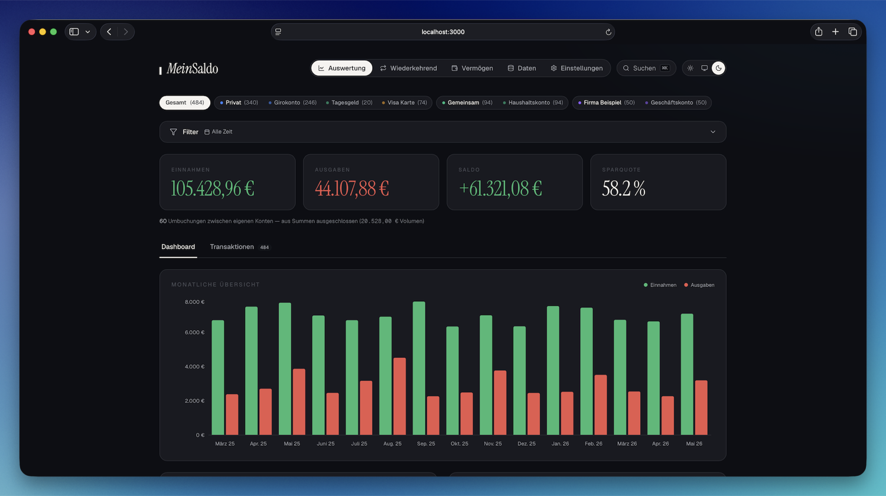
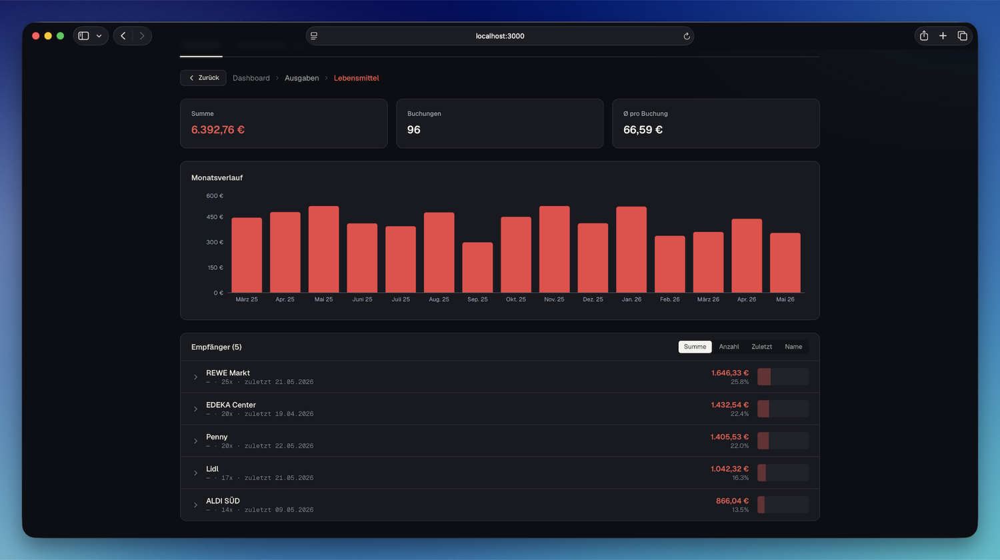
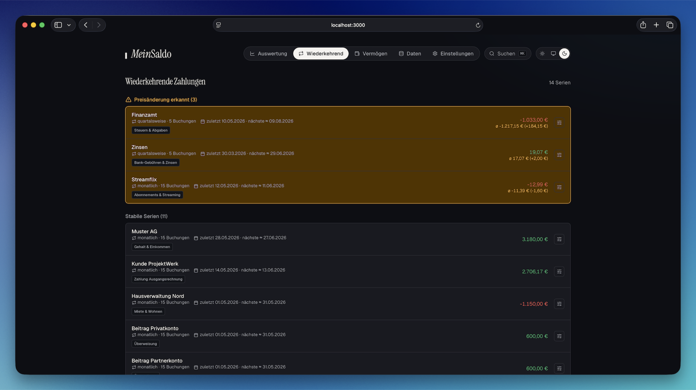
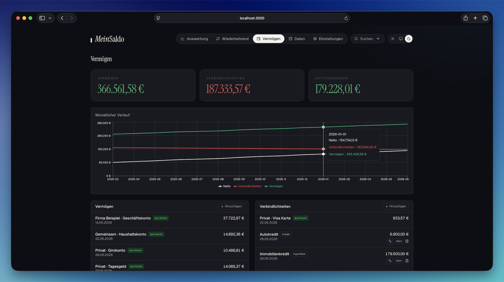
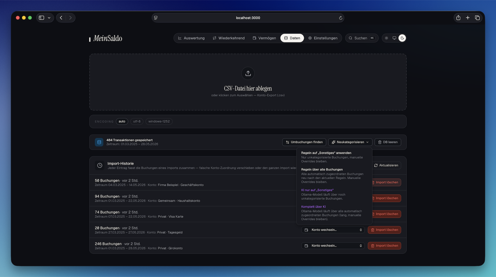
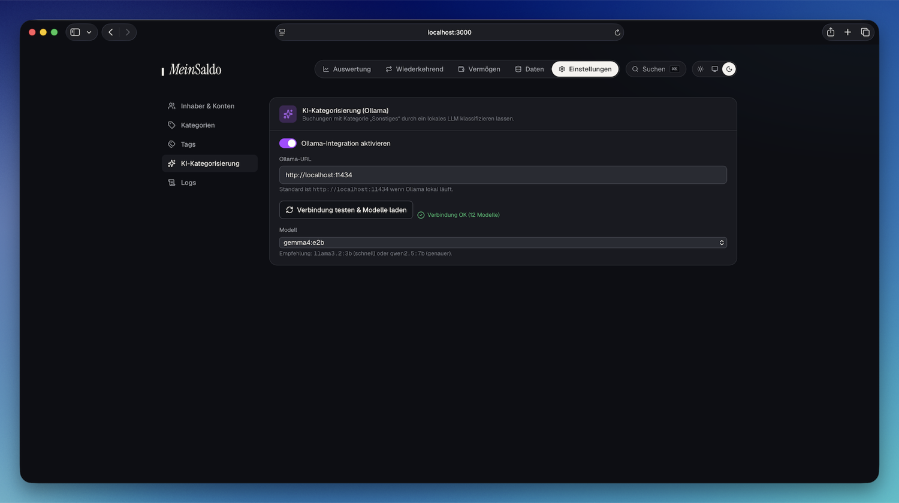

# MeinSaldo

> **v0.3.0** · Lokales Web-Tool zur Aufbereitung von Konto- und Kreditkarten-CSV-Exporten. Mehrere Banken parallel, Inhaber/Konten-Hierarchie, paarweise Umbuchungs-Erkennung, regelbasierte plus optional KI-gestützte Kategorisierung, Auswertung mit Filter und Vorjahresvergleich. Light- und Dark-Mode. **Alles bleibt auf deinem Rechner.**

<p align="center">
  
</p>

## Schnellstart

**Mit Docker (empfohlen für reine Nutzer):**

```bash
git clone https://github.com/thomas-deep/MeinSaldo.git
cd MeinSaldo
docker compose up -d
```

Zieht das vorgebaute Multi-Arch-Image (`ghcr.io/thomas-deep/meinsaldo:latest`,
`linux/amd64` + `linux/arm64`) aus der GitHub Container Registry — läuft
direkt auf NAS-Geräten wie Synology, UGreen und QNAP. App danach auf
[http://localhost:3000](http://localhost:3000), DB im persistenten Volume.

NAS-Setup und KI-Konfiguration in [`QUICKSTART.md`](QUICKSTART.md).

**Lokal mit Node** (für Entwicklung):

```bash
cd app
npm install
npm run dev
```

Gleiche URL, die SQLite-Datenbank wird unter `app/data/finanzen.db` angelegt; optionale Umgebungsvariablen siehe `app/.env.example`.

## Highlights

### Auswertung mit Drill-Down

Zeitraum-Filter, Vorjahresvergleich, Kategorien-Donut, klickbarer Monatschart. Klick auf eine Kategorie öffnet den Drill-Down über Empfänger bis zur Einzelbuchung — mit Breadcrumbs zurück.

<p align="center">
  
</p>

- **Filter-Leiste** mit Zeitraum-Presets (lfd. Monat/Quartal/Jahr, Vorjahre, „Letzte 12 Monate", Custom), Typ-Toggle, Min-Betrag, Volltext-Suche
- **Speicherbare Filter-Presets** — Filter-Kombination benennen, später per Dropdown wieder aktivieren
- **Hierarchischer Konto-Filter**: Gesamt · pro Inhaber · pro Konto · Nicht zugeordnet
- **CategoryChart** als Balken oder Donut, Mini-Slices unter 1 % zu „Übrige Kleinposten" gebündelt
- **Vorjahresvergleich** auf den SummaryCards mit Delta-Anzeige

### Wiederkehrende Zahlungen — automatisch erkannt

Abos, Miete, Gehalt werden aus Counterparty + Betrag + Intervall (monatlich / quartalsweise / jährlich) erkannt. **Preisänderungs-Alert**, wenn der letzte Betrag mehr als 8 % vom Durchschnitt abweicht.

<p align="center">
  
</p>

### Vermögensübersicht

Eigener Tab mit Summary-Cards und monatlichem Verlauf. Kontogruppen-Salden werden automatisch übernommen, daneben manuell pflegbare Posten für Depot, Immobilien, Kredite — mit Snapshot-Historie und optionalem Konto-Anker zur Saldo-Rekonstruktion.

<p align="center">
  
</p>

### CSV-Import mit Vorschau

Server-seitiges Parsing mit Vorschau vor dem Insert — neue vs. bereits vorhandene Buchungen werden ausgewiesen. **IBAN-Auto-Erkennung**: die Kontogruppe wird automatisch vorausgewählt, wenn die `IBAN Auftragskonto` aus der Datei einer gepflegten IBAN entspricht.

<p align="center">
  
</p>

- **Bank-Presets** für Volksbank/ING/Standard, DKB, comdirect, Sparkasse, Commerzbank, Deutsche Bank, American Express
- **Encoding-Auswahl** (auto / utf-8 / windows-1252) je Import oder via Preset
- **Dedup** beim Re-Import per inhaltsbasiertem Hash; manuelle Änderungen bleiben erhalten
- **Import-Historie** mit Konto-Wechsel und Batch-Delete

### Optionale KI-Kategorisierung (lokal)

Wenn ein lokales [Ollama](https://ollama.com) läuft, klassifiziert ein lokales LLM (z. B. `llama3.1`) die „Sonstiges"-Buchungen oder auf Knopfdruck auch alle. Drei Trigger: nach Import, auf ausgewählten Zeilen (Bulk), oder über Banner auf der Auswertung. Prompts und Antworten landen im Audit-Log.

<p align="center">
  
</p>

### Weitere Features

- **⌘K-Suche** mit FTS5-Index, umlaut-tolerantem Tokenizer, Prefix-Suche
- **Umbuchungs-Erkennung** paarweise zwischen Kontogruppen (gleicher Betrag, ±3 Tage) + IBAN-Match + Kreditkarten-Settlement
- **Tags** quer zu Kategorien (`urlaub-2025`, `renovierung`) für Querschnittsauswertungen
- **Bulk-Aktionen** in der Transaktionstabelle: Kategorie/Konto wechseln, Umbuchung markieren, KI-Klassifikation, Löschen
- **23+ vordefinierte Kategorisierungs-Regeln** mit ~830 Keywords; voll editierbarer Editor
- **Datenbank-Sicherung** (Einstellungen → Datenbank): komplette Backups anlegen, herunterladen/hochladen, wiederherstellen — optional AES-256-verschlüsselt; automatische Schutz-Sicherung vor Restore und „DB leeren"

### Sicherheit & Tooling

- **CSRF-Schutz** via Origin-Allowlist (Middleware), **SSRF-Härtung** für `ollamaUrl` (Default Loopback-only)
- **Zod-Validierung** auf allen mutierenden API-Routes, **Concurrency-Lock** auf AI-Endpoint (parallele Läufe → 429)
- **Vitest** mit 219 Tests — Domain-Logik **und** API-Routes mit isolierter In-Memory-SQLite pro Test
- **Light/Dark-Mode** mit Token-System auf oklch-Basis

## Dokumentation

- **[docs/USER_GUIDE.md](docs/USER_GUIDE.md)** — Anleitung für Nutzer: Workflows, Banken-Setup, Kategorien, KI
- **[docs/TECHNICAL.md](docs/TECHNICAL.md)** — Architektur, Datenmodell, API, Erweiterungspunkte
- **[docs/CSV_FORMATS.md](docs/CSV_FORMATS.md)** — Bank-spezifische Eigenheiten und Mapping-Details
- **[docs/CHANGELOG.md](docs/CHANGELOG.md)** — Releases und Iterations-Historie
- **[docs/AUDIT.md](docs/AUDIT.md)** — Historischer Audit-Report (alle Befunde sind in v0.1.0 adressiert)
- **[ROADMAP.md](ROADMAP.md)** — A/B/C-Priorisierung der nächsten Features
- **[CONTRIBUTING.md](CONTRIBUTING.md)** — Setup, Checks, Bank-Preset-Beitrag-Workflow

## Technik-Stack

- **Frontend**: Next.js 16 (App Router, Turbopack), React 19, TypeScript, Tailwind v4, Recharts, Lucide-Icons
- **Backend**: Next.js API-Routes mit SQLite (`better-sqlite3`, WAL-Mode) als embedded Storage
- **Validierung**: Zod
- **CSV**: PapaParse + Bank-Preset-Hooks
- **Tests**: Vitest
- **Optional KI**: Ollama (lokales LLM, Default-Port `11434`)

## Lokalität & Datenschutz

Alles bleibt auf dem Rechner:
- Keine externe API erforderlich
- Datenbank ist eine einzelne SQLite-Datei unter `app/data/`
- Ollama (falls aktiviert) läuft ebenfalls lokal
- Keine Telemetrie, keine Cloud-Sync, keine Auth (bewusst single-user, single-host)

> **Daten at rest:** Die SQLite-Datei liegt **unverschlüsselt** auf der Platte —
> eine DB-Verschlüsselung im Betrieb ist bewusst nicht eingebaut. Wer das
> absichern möchte, nutzt Datenträger-/Ordner-Verschlüsselung (FileVault, LUKS,
> verschlüsseltes NAS-Volume) und Zugriffsschutz. **Sicherungen** lassen sich in
> der App optional AES-256-verschlüsselt anlegen (Einstellungen → Datenbank).

## Konfiguration

Über `app/.env.local` (siehe `app/.env.example`):

| Variable | Default | Wirkung |
|---|---|---|
| `ALLOWED_ORIGINS` | `http://localhost:3000,http://127.0.0.1:3000` | Welche Origins darf der Browser auf mutierende Endpoints schicken |
| `ALLOWED_OLLAMA_HOSTS` | `localhost,127.0.0.1,::1` | Welche Hosts darf die `ollamaUrl`-Setting annehmen |
